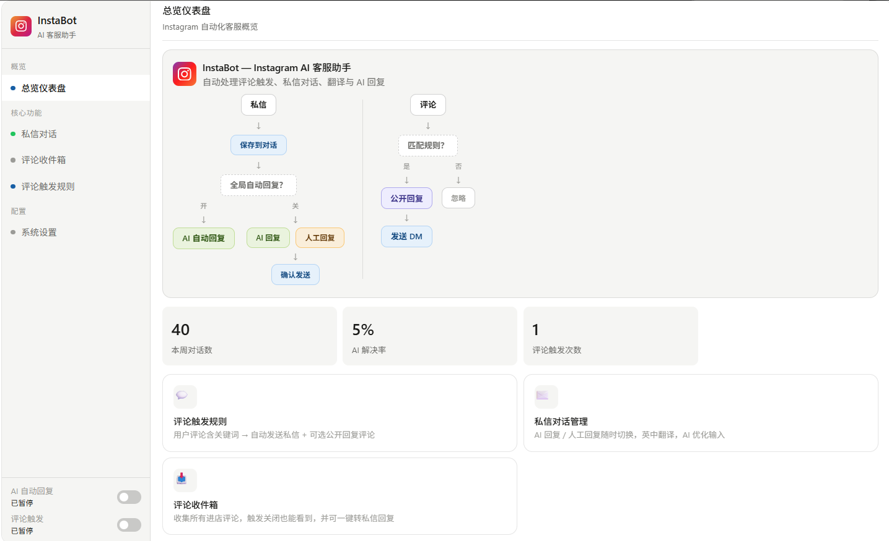
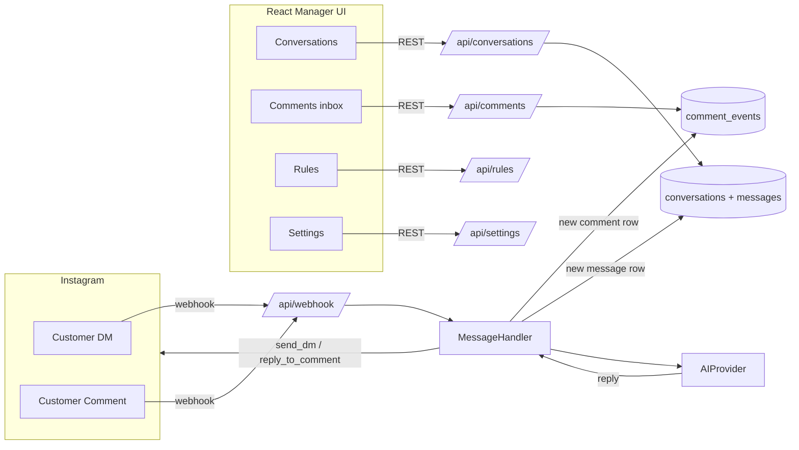

# InstaBot

An Instagram DM automation platform built around the FleetNow Delivery
sales workflow: incoming customer DMs are answered by a sales-persona
LLM, comments under your posts can fire keyword triggers, and a manager
dashboard lets you review every conversation, edit the AI draft before
sending, and switch any single chat to manual mode at any time.


> _Replace `docs/img/dashboard.png` with a real screenshot of the
> Dashboard page._

---

## Highlights

- **Multi-provider AI** — Anthropic Claude, OpenAI, Google Gemini, or any
  OpenAI-compatible custom endpoint, switchable per-deploy from the
  Settings page without restarting.
- **Intent-routed knowledge base** — pricing, coverage, sizes and pickup
  schedule live in separate markdown files; the router only injects the
  sections relevant to the customer's message, so most replies use 1–3K
  tokens of reference instead of 6–8K.
- **Manager preferences (auto-learning)** — every prompt hint you type
  in the "Generate Reply" box is distilled into a long-term style rule
  ("少用感叹号", "报价前先问月单量") and applied to all future replies.
- **Comment inbox** — every incoming Instagram comment is logged
  regardless of trigger settings, with an unread badge in the sidebar
  and a one-click "open in DMs" button to start a manual conversation.
- **Per-conversation mode** — global auto-reply switch is the master
  gate; each individual conversation can independently flip to human
  mode so the bot stays silent on the deals you handle yourself.
- **Translation strategy** — manager-facing drafts are always Chinese;
  the system translates to the customer's language at send time when
  the languages differ (or never, or always — your choice).
- **Welcome message** — optional auto-greet for first-time DMs.
- **Webhook + polling fallback** — the deployed mode uses Meta's Graph
  API webhooks; instagrapi polling is available for accounts without
  Business API access.

---

## Tech stack

| Layer | What it uses |
|---|---|
| Backend | Python 3.11 · FastAPI · SQLAlchemy 2 (async) · SQLite (`bot.db`) |
| AI | `anthropic`, `openai`, `google-generativeai` SDKs |
| Instagram | Meta Graph API (`graph.instagram.com/v21.0`) primary; instagrapi as fallback |
| Frontend | React 18 · TypeScript · Vite · plain CSS |
| Deploy | Ubuntu + systemd + nginx + certbot |

---

## Architecture at a glance



A deeper walk-through of every step (knowledge routing, preference
learning, the two reply paths) lives in [`docs/ARCHITECTURE.md`](docs/ARCHITECTURE.md).

---

## Quickstart (local dev)

Prerequisites: Python 3.11+, Node 20+, an Anthropic / OpenAI / Google
API key, and a Meta App with an Instagram Business Account if you want
to wire up real webhooks.

```bash
# 1. Backend
cd backend
python -m venv venv
source venv/bin/activate              # Windows: venv\Scripts\activate
pip install -e .
cp .env.example .env                  # then fill in API keys / IG token
uvicorn app.main:app --reload --port 8000

# 2. Frontend (separate terminal)
cd frontend
npm install
npm run dev                           # opens http://localhost:5173
```

Default login password is whatever you set in `.env` as
`AUTH_PASSWORD`. The first time the backend starts, it creates `bot.db`
and runs in-place schema migrations automatically (see `database.py`).

For a real production deploy on a Ubuntu server with HTTPS and a
Meta-verified webhook URL, follow [`docs/DEPLOY.md`](docs/DEPLOY.md)
end to end.

---

## Documentation map

| File | What's in it |
|---|---|
| [`README.md`](README.md) (this file) | One-page tour |
| [`docs/ARCHITECTURE.md`](docs/ARCHITECTURE.md) | System diagrams, AI reply flow, module layout, data model |
| [`docs/DEPLOY.md`](docs/DEPLOY.md) | First-time server setup, domain + HTTPS, Meta App + webhook configuration |
| [`docs/OPERATIONS.md`](docs/OPERATIONS.md) | Day-to-day playbook — token rotation, log inspection, knowledge updates, common error decoder |
| [`docs/CONFIG.md`](docs/CONFIG.md) | Reference for every `.env` variable and every `system_settings` key |

---

## Project status

This is a single-deployment internal tool, not a public product. Code
is intentionally kept compact — single SQLite file, no queue, no cache,
no microservices — so a future maintainer can read the whole backend in
a day.
