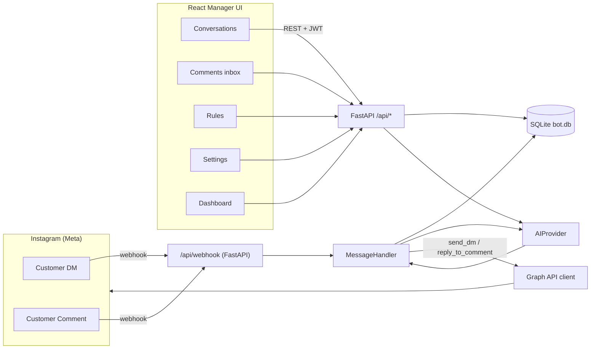
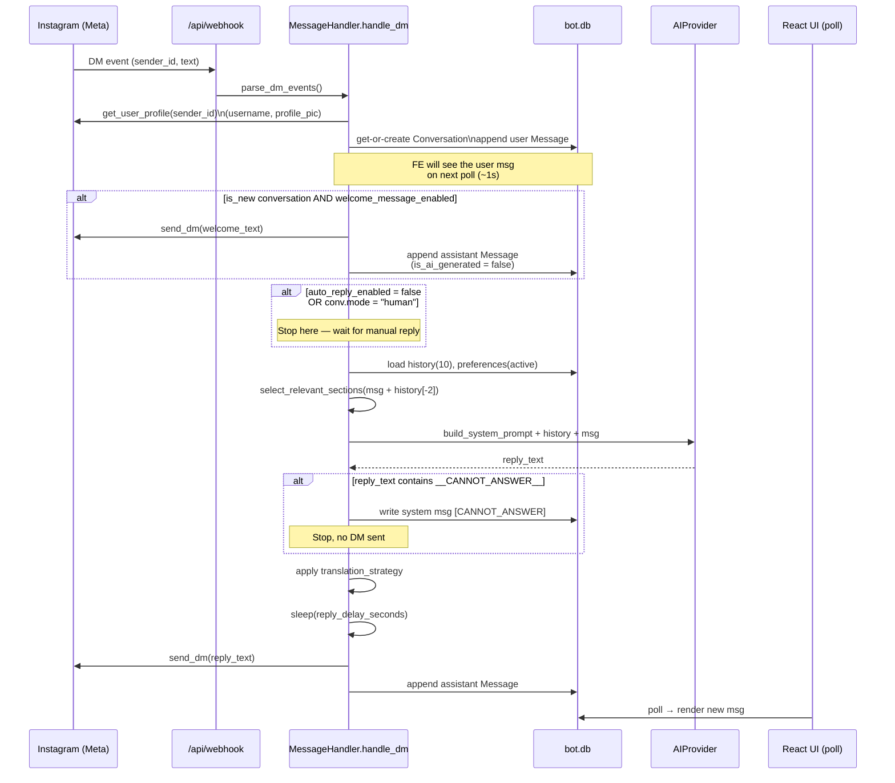
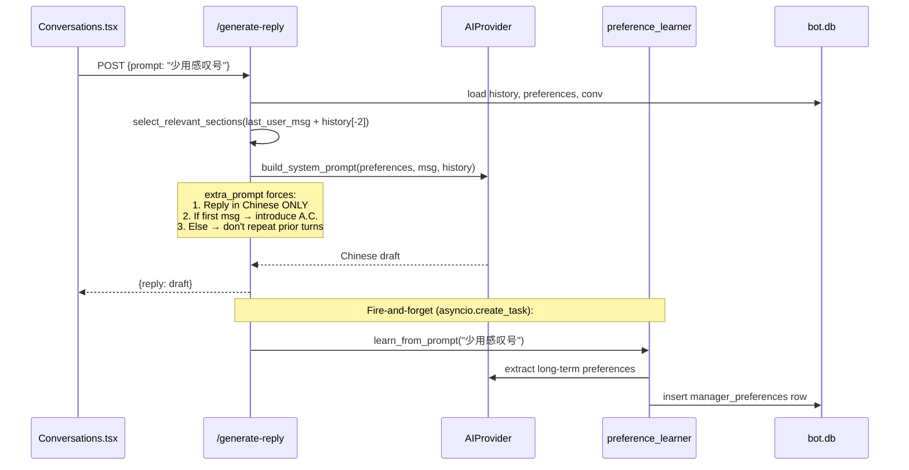
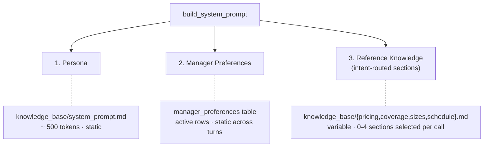
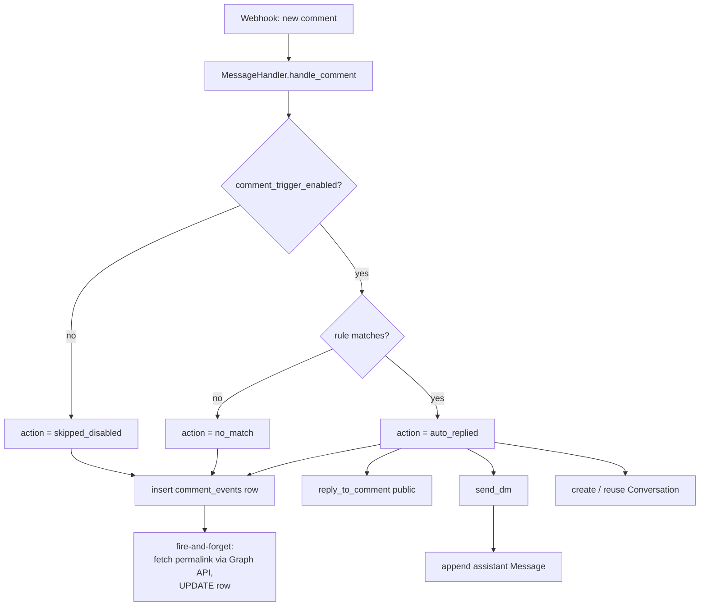
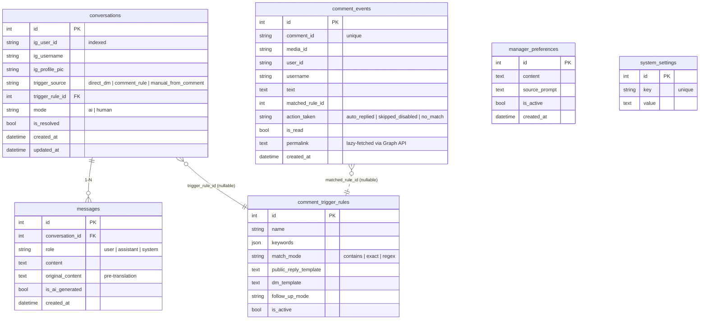

# Architecture

This is the system map. Read it once before changing anything more
invasive than a copy tweak. Operations-level "how do I" tasks live in
[`OPERATIONS.md`](OPERATIONS.md); env / setting reference is in
[`CONFIG.md`](CONFIG.md).

---

## 1. System overview

A single Python backend handles every Instagram event (DMs and
comments), routes them through an LLM, and persists everything to one
SQLite file. A React SPA gives the manager a dashboard for review and
manual override. There is no message queue, no cache, no microservice
split.



The backend lifespan (`backend/app/main.py`) wires three singletons
into `app.state` at startup:

| Object | Built by | Used by |
|---|---|---|
| `ai_provider` | `app.ai.factory.create_ai_provider` from env | `MessageHandler`, manual generate-reply, translator |
| `ig_client` | `app.instagram.factory.create_instagram_client` | `MessageHandler`, profile lookup, send DM |
| `message_handler` | `MessageHandler(ai, ig)` | webhook router, instagrapi polling |

---

## 2. AI auto-reply flow (incoming customer DM)



Two gates decide whether the AI runs at all:

1. Global `auto_reply_enabled` (Settings UI master switch)
2. Per-conversation `mode` field (radio toggle in chat header)

Both must be `true` / `"ai"` for the bot to reply automatically.

---

## 3. Manual generate-reply flow (manager click)

This path is what powers the **Generate Reply** button in the
Conversations page. It always returns a Chinese draft for the manager
to review; translation to the customer's language happens later, when
the manager clicks **Send**.



When the manager clicks **Send**, a separate `/send` endpoint applies
the translation strategy (Chinese → English when the customer is
English-speaking) and dispatches via the IG client.

---

## 4. Knowledge architecture

The system prompt fed to the LLM is built per-call from three layers:



### Section routing (`backend/app/knowledge/sections.py`)

Pure keyword + Canadian FSA-postal-code regex over the current message
joined with the last 2 history messages. No LLM, no embedding, no
network — runs in microseconds.

| Section | Sample triggers (English / Chinese) | File |
|---|---|---|
| `pricing` | price, cost, quote, $, how much / 价格, 多少钱, 报价 | `pricing.md` |
| `coverage` | deliver to, ship to, cover, postal, M4W, Hamilton, Calgary / 送到, 覆盖, 多伦多 | `coverage.md` |
| `sizes` | size, weight, lb, kg, package, oversize / 尺寸, 重量, 包裹 | `sizes.md` |
| `schedule` | when, pickup, cutoff, tomorrow, evening / 几点, 取件, 截止, 明天 | `schedule.md` |

Two reinforcement rules:

1. **Postal-code mention** (e.g. `M4W`, `T2A`) ⇒ always pulls in
   `pricing` + `coverage` even without verb keywords.
2. **History window** = last 2 turns. So `"yes"` or `"M4W"` alone
   inherits intent from the previous turn.

### Token budget

| Customer message | Sections loaded | Approx system prompt tokens |
|---|---|---|
| `"hi"` | (none) | ~500 |
| `"How much for M4W?"` | pricing + coverage | ~3K |
| `"What size limits?"` | sizes | ~900 |
| `"When can I pickup tomorrow?"` | schedule | ~2K |
| `"Price for big package to L8P?"` | pricing + coverage + sizes | ~3.4K |

Compare to the naive "load everything every call" approach (~6-8K).

---

## 5. Comment event flow

Every comment is logged regardless of trigger settings. The auto
public-reply + auto DM only fires when `comment_trigger_enabled = true`
AND a rule matches.



The Comments inbox UI (`/comments`) reads `comment_events` directly,
shows an unread badge in the sidebar, and the **Open in DMs** button
calls `/api/comments/{id}/open-conversation` which find-or-creates the
Conversation and redirects to `/conversations?conv=ID`.

---

## 6. Translation strategy

`translation_strategy` setting (Settings UI) decides what happens to
the AI-produced text right before it's actually sent to Instagram.
Both the auto-reply path (`MessageHandler.handle_dm`) and the manual
`/send` endpoint apply the same logic.

| Strategy | When the reply is translated |
|---|---|
| `always` | Every send: detect language with CJK regex, flip zh ↔ en. |
| `auto` | Only when the reply language differs from the customer's last message. |
| `never` | Pass through verbatim. |

Manual generate-reply ALWAYS produces Chinese (system override in
`/generate-reply`), so under `auto` an English customer's reply gets
translated, while a Chinese customer keeps the draft as-is.

---

## 7. Data model

Six tables, all created by `Base.metadata.create_all` on startup. Tiny
in-place ALTERs run from `init_db()` for additive columns (currently
just `comment_events.permalink`).



A 7th table (`knowledge_entries`) survives in `bot.db` from the legacy
markdown-Q&A approach but is no longer touched by any code path. See
the commit history if you want to inspect old data via raw `sqlite3`.

---

## 8. Backend module map

```
backend/app/
├── main.py            FastAPI lifespan, route mounts, CORS
├── config.py          Pydantic settings reader (.env + defaults)
├── database.py        async engine, session factory, init_db + ALTERs
├── security.py        JWT issuance + verify_token dependency
├── api/               REST endpoints (one file per resource)
├── ai/                LLM provider abstraction
├── instagram/         IG client abstraction (Graph API + instagrapi)
├── knowledge/         markdown KB loader + intent router
├── models/            SQLAlchemy declarative models
├── schemas/           Pydantic request/response shapes
├── services/          Cross-cutting business logic
└── webhook/           Meta webhook signature verify + payload parser
```

### Layer-by-layer

**`api/`** — thin HTTP handlers. Auth dep is `verify_token`; every
router includes it except `/api/auth/login`.

| File | Surface |
|---|---|
| `auth.py` | `POST /api/auth/login` returns JWT |
| `dashboard.py` | `GET /api/dashboard/stats` (counts) |
| `conversations.py` | List / get / send / generate-reply / mode toggle / translate / assist |
| `comments.py` | List events, mark read, backfill permalinks, open-conversation |
| `rules.py` | CRUD for `comment_trigger_rules` |
| `settings.py` | `GET / PATCH /api/settings` reads/writes `system_settings` keys |
| `preferences.py` | CRUD for `manager_preferences` |

**`ai/`** — `AIProvider` abstract base with `generate_reply`,
`translate_message`, `translate_and_improve`, plus a concrete
`reload_knowledge(preferences, user_message, history)` that rebuilds
`self.system_prompt` via `prompt.build_system_prompt()`. Three concrete
providers: `claude_provider.py`, `openai_provider.py`,
`google_provider.py`. `factory.py` picks the provider per model id
prefix; the OpenAI provider doubles as a custom-endpoint client when
`base_url` is set.

**`instagram/`** — `InstagramClient` ABC: `start_polling`, `stop_polling`,
`send_dm`, `reply_to_comment`, `get_user_profile`. Two impls. The
Graph API impl owns the `httpx.AsyncClient` and the page access token;
it also exposes `get_media_permalink` for the comment inbox.

**`knowledge/`** — `loader.py` only exports `KNOWLEDGE_DIR`.
`sections.py` does the keyword routing + section file load.

**`services/`** —

| File | Role |
|---|---|
| `message_handler.py` | DM and comment dispatcher; the heart of the auto path |
| `comment_trigger.py` | Keyword matching (contains / exact / regex) and `{{username}}` template render |
| `preference_learner.py` | LLM-powered distillation of long-term style rules from prompt hints |
| `translator.py` | Wraps `ai.translate_and_improve` for the manual "Assist input" UI |

**`webhook/`** — `router.py` verifies `X-Hub-Signature-256` and turns
the JSON payload into `IncomingMessage` / `IncomingComment` dataclasses
via `parser.py`, then schedules `MessageHandler.handle_dm` /
`handle_comment` as background tasks so the 200 OK to Meta is fast.

---

## 9. Frontend structure

```
frontend/src/
├── App.tsx               Router + auth gate
├── main.tsx              ReactDOM bootstrap
├── api/client.ts         Single fetch wrapper, JWT, all REST helpers
├── types/index.ts        Mirror of backend pydantic shapes
├── components/
│   ├── Layout.tsx        Sidebar + main outlet
│   └── Sidebar.tsx       Nav links + unread badges
└── pages/
    ├── Login.tsx
    ├── Dashboard.tsx     Stats + flow diagram + feature cards
    ├── Conversations.tsx Two-pane chat list + detail + AI panel
    ├── Comments.tsx      Comment events inbox
    ├── Rules.tsx         Comment trigger rule CRUD
    └── Settings.tsx      Every system_settings key + preferences panel
```

State is simple `useState` plus a 1-2s polling pattern (no websockets,
no global store). The `Conversations` page accepts a `?conv=ID` query
param so the Comments inbox can deep-link to a specific chat.

---

## 10. Async background tasks

Two `asyncio.create_task` fire-and-forget jobs run alongside normal
request handling:

1. **Permalink enrichment** — after a `comment_events` row is inserted,
   `MessageHandler._enrich_event_permalink` calls Graph API for the
   post's public URL and UPDATEs the row. Failure is logged at WARNING
   and the row stays without a permalink (UI shows
   "帖子链接获取中...").

2. **Preference learning** — after each manual `/generate-reply`
   call, `preference_learner.learn_from_prompt(extra_prompt)` asks the
   LLM whether the prompt hint encodes a long-term rule (e.g. "少用感叹号"
   ✓) versus a one-off instruction (e.g. "shorter please" ✗) and
   inserts qualifying rules into `manager_preferences`. The manager
   reviews / disables / deletes from the Settings page.

Both intentionally do not block the user-facing response. There is no
retry, no dead-letter; they're best-effort enrichment.

---

## 11. Hotspots / known sharp edges

- **Token rotation pain** — see [`OPERATIONS.md`](OPERATIONS.md). An IG
  password change invalidates the token instantly.
- **Profile-lookup storm** — `list_conversations` lazy-fetches missing
  usernames/avatars. To prevent burning Graph API quota on a dead
  token, a 30-min in-memory cooldown skips users with recent failures
  and the lookup is gated on `ig_client.connected`.
- **Anthropic rate limit** — knowledge sections are size-capped because
  the org sits on a 30K input-tokens-per-minute tier. If you upgrade
  the tier, you can relax `MAX_CHARS` in any future section filter.
- **No retries on failed Meta send** — if `send_dm` returns a non-2xx
  the assistant message is still saved to DB but `ig_sent=false`. Handle
  in UI with the toast "已保存但未发送".
- **Auth secret rotation invalidates active sessions** — changing
  `AUTH_SECRET_KEY` will force every dashboard user to log in again.
